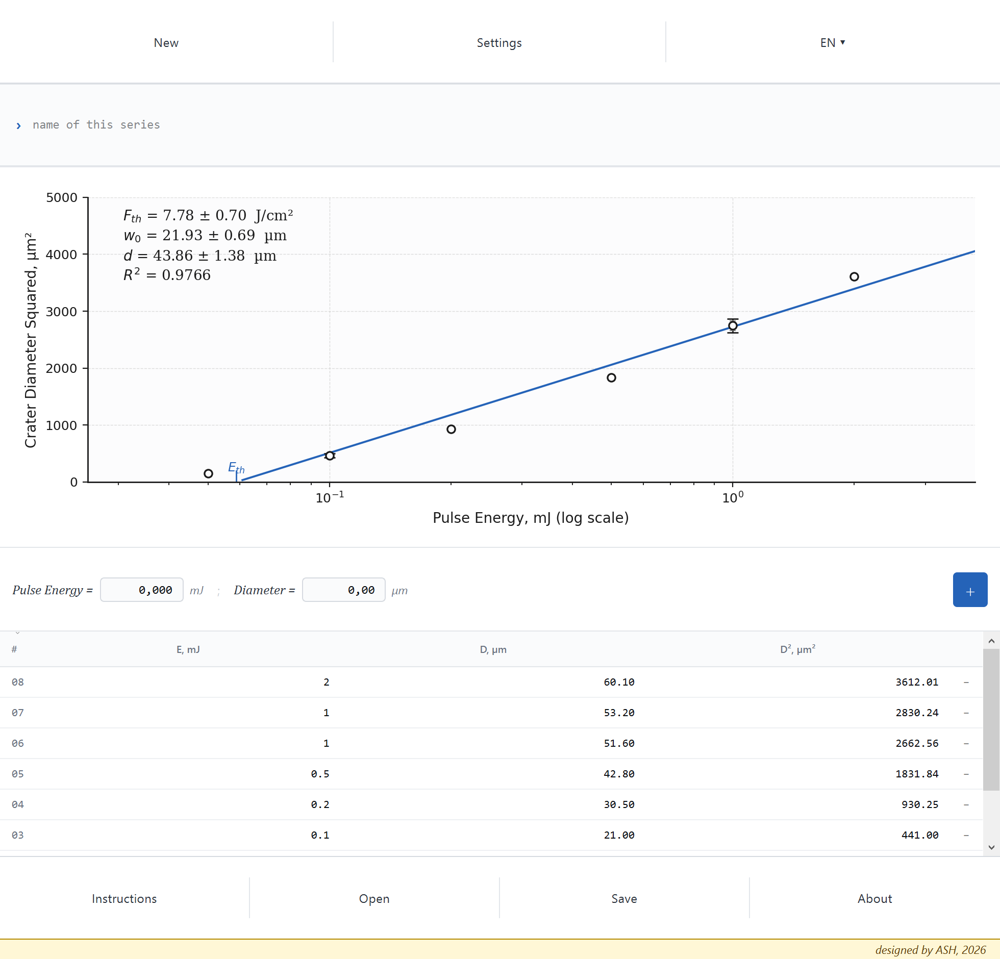
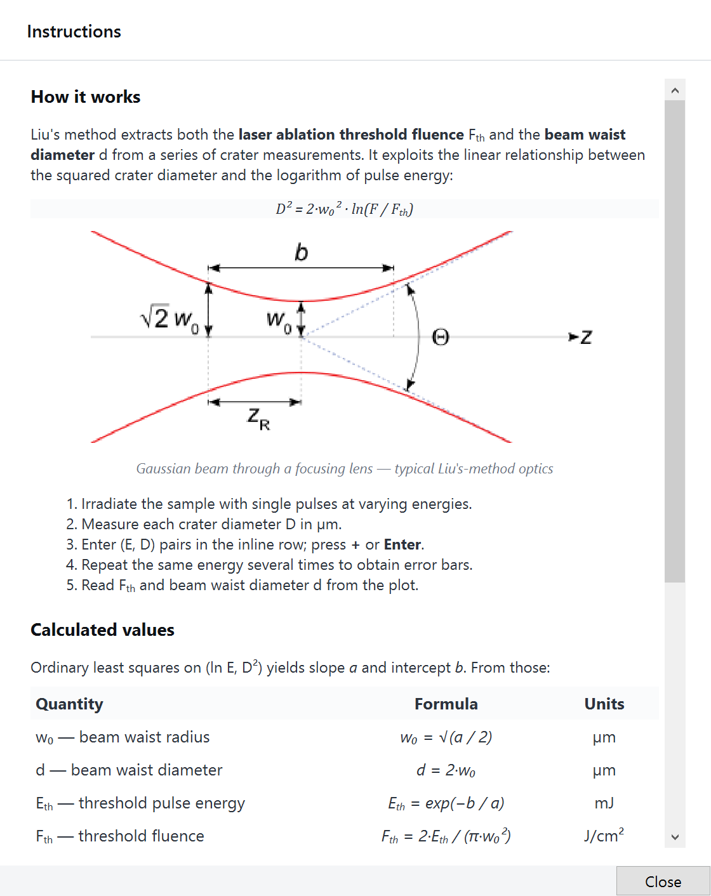
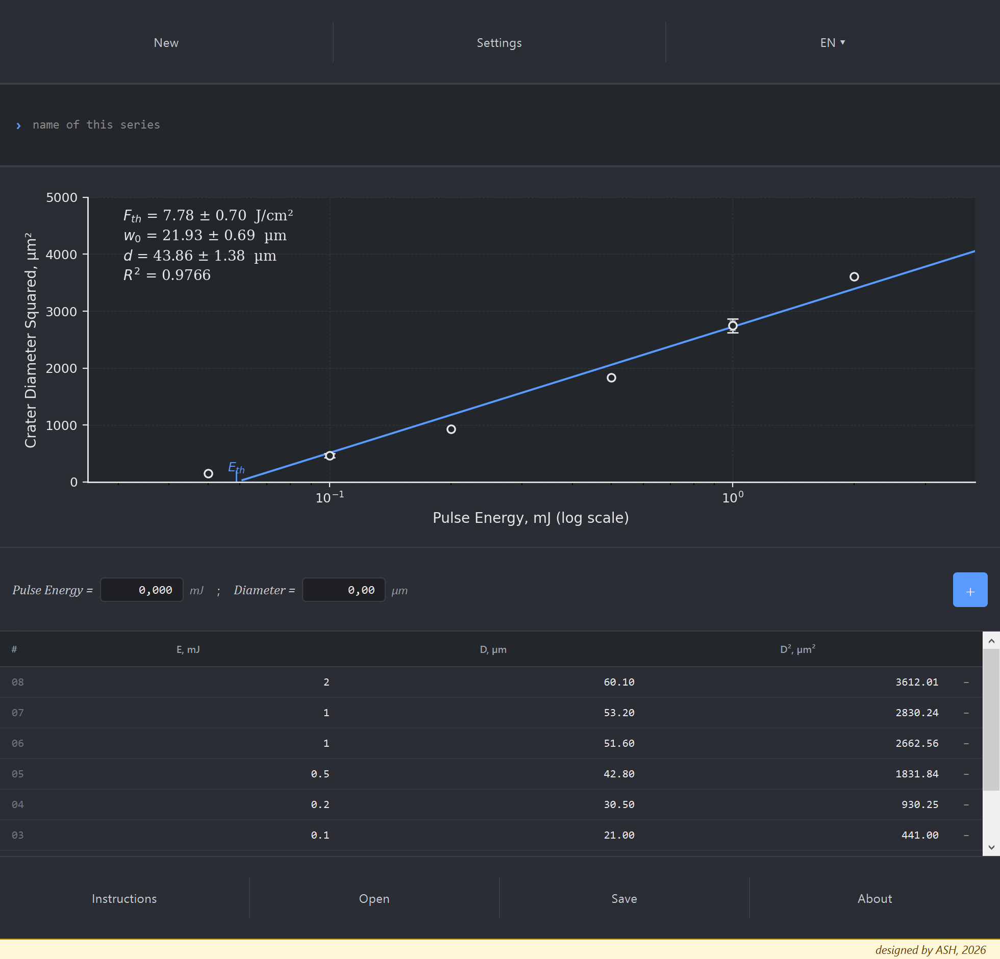

# Liu Threshold Analyzer

**Type in the craters your laser left, read off the ablation threshold and the true beam waist, each with its error bar. One window, nothing to install.**

[](https://github.com/ashbmstu/Liu/actions/workflows/ci.yml)
[](LICENSE)


<p align="center">
  <a href="https://github.com/ashbmstu/Liu/releases/latest/download/LiuAnalyzer.exe"></a>
</p>

Fire single laser pulses at a material, vary the energy, and measure the little
crater each one leaves. Plot the square of the crater diameter against the
logarithm of the pulse energy and the points fall on a straight line. Where that
line crosses zero tells you the **ablation threshold** — the fluence below which
the material is not damaged at all — and how steeply it climbs tells you the
**beam waist**, the true focused width of the beam at the sample.

That is Liu's method, published in 1982, and it is still the standard way to
measure both numbers at once. This is a small Windows program that does the
arithmetic, keeps the uncertainties honest, and draws the plot.

<p align="center">
  
</p>

## In your language

The whole interface is translated, the Instructions included. Pick a language
from the menu in the top bar; English is the default.

- **English** — A Windows app that finds the laser ablation threshold and the beam waist from crater diameters, by Liu's method.
- **中文** — 一款 Windows 应用：用 Liu 方法，根据烧蚀坑直径求出激光烧蚀阈值和光束束腰。
- **Español** — Aplicación para Windows que calcula el umbral de ablación láser y la cintura del haz a partir del diámetro de los cráteres, por el método de Liu.
- **Français** — Application Windows qui détermine le seuil d'ablation laser et le col du faisceau à partir du diamètre des cratères, par la méthode de Liu.
- **Русский** — Приложение для Windows: определяет порог лазерной абляции и перетяжку пучка по диаметрам кратеров методом Лиу.

## Getting started

1. **Download [LiuAnalyzer.exe](https://github.com/ashbmstu/Liu/releases/latest/download/LiuAnalyzer.exe).**
   It is a single file of about 50 MB. There is nothing to install, and you do
   not need Python.
2. **Double-click it.** The first start takes a few seconds while it unpacks.
3. **If Windows says it protected your PC**, click **More info**, then
   **Run anyway**. The file is not signed with a paid certificate, and that is
   all the warning means. Every release is built from this repository's source
   by the [release workflow](.github/workflows/release.yml), not on anybody's
   own computer.
4. **Choose your language** from the **EN ▾** menu in the top bar.

It runs on Windows 10 (version 1809 or later) and Windows 11. Earlier versions
of the program are on the [releases page](https://github.com/ashbmstu/Liu/releases).

**From source**, if you would rather:

```bat
py -3.11 -m venv .venv
.venv\Scripts\activate
pip install -r requirements.txt
python run.py
```

## What you see

| | |
|---|---|
| **The chart** | Squared crater diameter against pulse energy. Liu's method makes this a straight line, so a glance tells you whether the data is any good |
| **The fit box** | Threshold fluence, beam waist radius and diameter, each with a 1σ uncertainty, and the R² of the fit |
| **Error bars** | Appear automatically when you measure the same energy more than once — the sample standard deviation of those repeats |
| **The table** | Every measurement, sortable, with its squared diameter worked out. Hover a row to highlight its point |

## Using it

1. **Irradiate your sample** with single pulses, changing the pulse energy
   between them. Five or six energies spread over a decade works well.
2. **Measure each crater diameter** under a microscope, in micrometres.
3. **Type each pair in** at the bottom of the window — pulse energy in mJ,
   diameter in µm — and press **Enter** or the **+** button.
4. **Repeat an energy two or three times** if you can. The repeats become error
   bars and are what make the uncertainties mean anything.
5. **Read the answers off the chart.** They update as you type.

The window opens with six greyed-out demo points so that it is never blank. They
disappear the moment you enter a measurement of your own, or press **New**.

> [!WARNING]
> **The method assumes a single-pulse, Gaussian beam.** The straight line comes
> from the Gaussian intensity profile, so a top-hat, a badly aberrated focus or a
> multi-pulse exposure will still produce a tidy-looking fit and a number that
> means nothing. A high R² says the points are collinear; it does not say your
> beam was Gaussian.

## What the numbers mean

| | |
|---|---|
| **F<sub>th</sub>** | Threshold fluence, in J/cm². Below this the pulse leaves no crater. This is usually the number you came for |
| **w<sub>0</sub>** | Beam waist radius at the sample, in µm — the 1/e² radius |
| **d** | Beam waist diameter, 2·w<sub>0</sub>. The number to compare against your optics |
| **R²** | How well the points fit a straight line. Below about 0.95, look at the plot before trusting anything |

Everything is derived from one ordinary least-squares fit of *D²* against
ln *E*, and the uncertainties are propagated from that fit's covariance matrix,
so they are 1σ statistical errors on the regression — not an estimate of how
carefully you measured the craters.

## The method in one line

    D² = 2·w₀² · ln(F / F_th)

The built-in **Instructions** dialog derives every quantity from the fitted
slope and intercept, and gives the error-propagation expression for each one.

<p align="center">
  
</p>

## Other things it does

**Five languages.** English, Chinese, Spanish, French and Russian, switched from
the top bar. Everything is translated, the Instructions and About dialogs
included.

**Two themes.** Light and dark, switched from Settings. The dark one is for
people who work next to a laser in a darkened room.

<p align="center">
  
</p>

**Save and reopen your work.** *Save* writes either a JSON session, which *Open*
reads back later, or a PNG of the chart with the data table drawn underneath it,
which is the one to put in a report.

**A log**, at `%LOCALAPPDATA%\LiuAnalyzer\liu.log`, if it ever misbehaves.

## Project layout

| Path | Purpose |
|---|---|
| `src/liu_analyzer/analysis.py` | The mathematics: grouping, least squares, derived quantities |
| `src/liu_analyzer/models.py` | `Measurement`, `Group`, `FitResult`, `DerivedResults` |
| `src/liu_analyzer/persistence.py` | JSON save and load, and where files go |
| `src/liu_analyzer/strings.py` | Every piece of UI text, in all five languages |
| `src/liu_analyzer/app.py` | Application setup, themes, logging, entry point |
| `src/liu_analyzer/widgets/` | The window and its parts: chart, table, add-row, dialogs |
| `tests/` | Unit tests for the analysis, persistence and translations |
| `tools/screenshots.py` | Regenerates the images in `docs/img` from the running application |
| `packaging/` | PyInstaller spec and the Windows version resource |
| `build.bat` | The local build: venv, dependencies, tests, then `dist\LiuAnalyzer.exe` |
| `.github/workflows/` | CI on every push, and the release build on every version tag |

`analysis.py` and `models.py` import nothing from Qt. The mathematics can be
used from a script or a notebook without a display anywhere near it.

## Development

```bat
pytest tests                  :: unit tests
ruff check .                  :: lint
python tools\screenshots.py   :: redraw the images in docs/img
build.bat                     :: venv, dependencies, tests, then a one-file .exe
```

`tools\screenshots.py` lays the window out without ever putting it on screen,
so the images in this README can be regenerated after an interface change
instead of going stale. It doubles as a crude smoke test of the interface,
which the unit tests deliberately do not cover.

`build.bat` redirects PyInstaller's scratch directory to `%TEMP%`, because a
sync client holding a file lock inside the project folder — Google Drive,
OneDrive, Dropbox — otherwise breaks the `--clean` step.

### Releasing

The download link at the top of this page always points at the newest release,
and a release is made by pushing a version tag:

1. Put the new version number in `src/liu_analyzer/__init__.py`,
   `pyproject.toml` and `packaging/version_info.txt`, and describe the changes
   in `CHANGELOG.md`.
2. Commit, then tag and push the tag:

   ```bat
   git tag -a v1.1.0 -m "Liu Threshold Analyzer 1.1.0"
   git push origin v1.1.0
   ```

The [release workflow](.github/workflows/release.yml) refuses a tag that
disagrees with any of those four files, runs the tests, builds
`LiuAnalyzer.exe` on a clean Windows machine and publishes it, with the
changelog entry as the release notes.

## Project status

Working and in use. Version 1.0.1 — see [CHANGELOG.md](CHANGELOG.md). It does
one job and is not expected to grow much; bug reports and translation fixes
are the most likely changes.

## Contributing

A dataset where the tool gets the physics wrong is the most useful thing
anyone can send: the measurements, the answer you expected, and where it came
from. Translation corrections from native speakers are the next most useful.
See [CONTRIBUTING.md](CONTRIBUTING.md).

## Citing this

If you publish work that used this tool, cite the method. [CITATION.cff](CITATION.cff)
has both entries in machine-readable form, and GitHub will format them for you
from the sidebar.

> Liu, J. M. (1982). Simple technique for measurements of pulsed Gaussian-beam
> spot sizes. *Optics Letters*, **7**(5), 196.

## Licence

MIT — see [LICENSE](LICENSE). Third-party attributions, including the licences
of everything bundled into the `.exe`, are in [NOTICE](NOTICE).

The Gaussian-beam diagram in the Instructions dialog is not MIT: it is by
Rodolfo Hermans after Dr. Bob, from Wikimedia Commons, under
[CC BY-SA 3.0](https://creativecommons.org/licenses/by-sa/3.0/).
